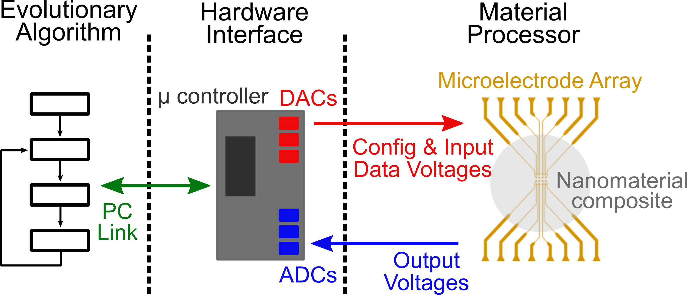
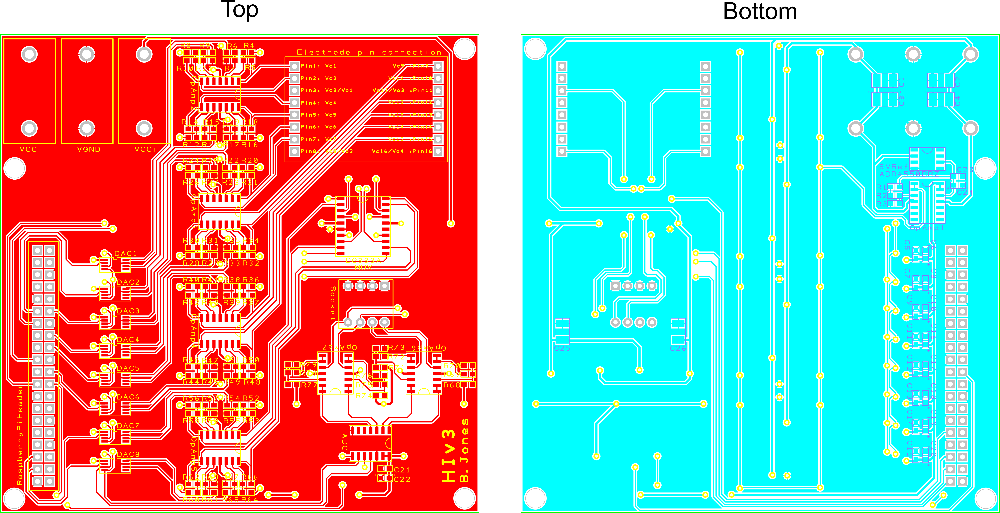

# phd-HIv3
The software used to control the Hardware Interface, consisting of a Raspberry Pi used to control the HIv3 Printed Circuit Board (PCB) to apply and read voltages to a nanomaterial.
This enables fast and easy controls to perform Evolution in-Materio [1].
Evolutionary Algorithms [2] are used by optimising external stimuli to make some conductive nanomaterial do a task (e.g., classififcation)!

## PCB

The printed circuit board can be seen below.
Further information such as the circuit schematic and BOm can be found in the PCB_Design folder.

## References 

[1] Benedict. A. H. Jones, J. L. P. Chouard, B. C. C. Branco, E. G. B. Vissol-Gaudin, C. Pearson, M. C. Petty, N. Al Moubayed, D. A. Zeze, and C. Groves, “Towards Intelligently Designed Evolvable Processors,” Evolutionary Computation, pp. 1–23, Mar. 2022. [Online]. Available: https://doi.org/10.1162/evco_a_00309

[2] https://github.com/benedictjones/pyeas